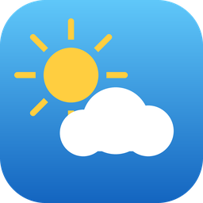

<p align="center">
  
</p>

<h1 align="center">🌦️ Meteo Tracker — per-person weather for Home Assistant</h1>

<p align="center">
  <a href="https://github.com/hacs/integration"></a>
  
  <a href="CHANGELOG.md"></a>
  
</p>

A **complete, professional** weather integration that gives **each person their own
weather**, based on where they actually are. You pick one or more `device_tracker`
entities; Meteo Tracker follows each person's live GPS position and pulls a full
weather picture from the **OpenWeather One Call API** — refreshed **every 10 minutes**
by default (see the call budget below).

> 🇮🇹 *Versione italiana più in basso → [Italiano](#-italiano).*

---

## ✨ Features

- 👥 **Multi-person / multi-user** — follow as many people as you like. Each tracker
  becomes its own Home Assistant **device** with a weather entity + sensors.
- 📍 **Location-aware** — weather is fetched at each person's *current* coordinates,
  so it updates as they travel.
- 🌡️ **Every nuance** — temperature & feels-like, min/max, pressure, humidity, dew
  point, UV index, cloud cover, visibility, wind speed/gust/bearing/direction,
  rain & snow, precipitation probability, daily human-readable summary.
- 🌅 **Sun & moon** — sunrise, sunset, moonrise, moonset, named moon phase.
- 🫁 **Air quality** — AQI plus PM2.5, PM10, O₃, NO₂, SO₂, CO, NO, NH₃.
- ⚠️ **Government weather alerts** — exposed as a binary sensor with full details.
- 📈 **Full forecasts** — hourly (48 h), daily (8 days) and twice-daily, via the
  modern Home Assistant forecast API (works with the Weather Forecast card).
- 🔀 **One Call 3.0 or 4.0** — detected from your key at setup, and switchable later.
  New OpenWeather accounts can only buy 4.0; keys that already have 3.0 keep it.
- ⏱️ **10-minute refresh** by default — adjustable from 1 min on One Call 3.0, and
  from 10 min on 4.0, where a refresh costs six requests instead of one.
- 💰 **Call-budget friendly** — people standing in the same spot share a single set of
  requests (coordinates are de-duplicated to ~11 m), and both the setup and Configure
  screens show what your settings actually spend per day.

---

## 📋 Requirements

- Home Assistant **2024.12** or newer.
- At least one **GPS-based `device_tracker`** (HA Companion App, Owntracks, Traccar,
  iCloud, Life360, etc.).
- An **OpenWeather One Call** key — 3.0 or 4.0 (free tier available — see below).

### Getting an API key

1. Create a free account at [openweathermap.org](https://openweathermap.org/).
2. Go to **API keys** and copy your key.
3. Subscribe to **“One Call by Call”**. It is **free up to 1,000 calls/day** — to
   stay free, open *Billing plans → set a “calls per day” limit of 1000* so you are
   never charged.

#### Which One Call version will I get?

Whichever one your account can buy — Meteo Tracker works out which at setup and
remembers the answer, so there is nothing to choose.

- **New accounts get One Call 4.0.** OpenWeather no longer offers 3.0 on the
  Billing plans page of a newly created account.
- **Keys that already have a 3.0 subscription keep using it.** 3.0 has not been
  switched off, and it is the cheaper of the two here — one request per refresh
  against six — so Meteo Tracker prefers it whenever it works.

> **If OpenWeather ever stops serving One Call 3.0**, entries using it will fail
> with an authentication error and Home Assistant will ask you to reconnect.
> Reconnecting re-checks your key, moves the entry to whichever version the key
> still reaches, and keeps every entity and all of its history — you do not need
> to remove and re-add the integration. No retirement of 3.0 has been announced;
> OpenWeather's migration guide says only that it "isn't being switched off as
> part of this release".

Already set up and want to move? **Settings → Devices & Services → Meteo Tracker →
Configure** has a *One Call API version* field. Subscribe to the other product on
openweathermap.org first — a subscription to one version does not extend to the
other — then switch it here. The change is checked against OpenWeather before it is
saved, so a version you have not bought is refused instead of breaking the entry.

> A brand-new key can take **a couple of hours** to activate, and during that
> window OpenWeather refuses it exactly as it refuses an unsubscribed key. If
> setup fails right after you created the key, wait and try again — the reason
> OpenWeather actually gave is written to the Home Assistant log.

#### What actually changes between 3.0 and 4.0

Measured by fetching both for the same point in the same minute and pushing each
through all 40 sensors:

| | One Call 3.0 | One Call 4.0 |
|---|---|---|
| Sensors that lose a value | — | **none** |
| Current / minute / hourly / daily | 14 fields · 60 · 48 · 8 | identical |
| Weather alert text | English | **the language you configured** |
| Weather alert name (`event`) | e.g. *Yellow High-temperature Warning* | returned empty; the alert's own tag is used instead |
| Requests per refresh | **1** | **6**, plus one per active alert |
| Shortest refresh interval | 1 min | **10 min** |

So migrating buys one thing — alerts you can read in your own language — at six
times the requests. While your 3.0 subscription works, there is no other reason to
move; when it stops, reconnecting carries you across without losing anything.

#### 💰 Call-budget cheat sheet

One refresh of one location costs **1 request on One Call 3.0**. On **4.0** the same
picture is rebuilt from **6** — current conditions, the minute timeline, three pages
of hourly (it returns 20 records at a time and we want 48) and one page of daily —
plus **one request per active weather alert**, because 4.0 returns alert IDs and
charges for the text behind each one. Air quality uses a **separate free API** and
does *not* count against the 1,000/day budget either way.

**On 4.0 the shortest interval is 10 minutes.** The reason is cost, not freshness.
OpenWeather updates *both* models every 10 minutes and its documentation recommends
polling *either* version at that rate — so a 5-minute interval fetches the same data
twice on 3.0 as well. There it costs one request and nobody notices; on 4.0 it costs
six, and a refresh you cannot use is a refresh you paid full price for.

⚠️ **The daily allowance belongs to your OpenWeather account, not to this
installation.** It is shared by every API key on the account and by everything using
them — a second Home Assistant, a test instance, a script of your own. Two
installations cannot see each other, so each can sit on its own minimum interval
while together they are over the limit.

Daily One Call requests, **one distinct location per installation** — ✅ within the
free 1,000/day, ⚠️ past it.

**One Call 3.0** — 1 request per refresh:

| Refresh interval | 1 installation | 2 | 3 |
|---:|---:|---:|---:|
| **5 min** | 288 ✅ | 576 ✅ | 864 ✅ |
| **10 min** | 144 ✅ | 288 ✅ | 432 ✅ |
| **15 min** | 96 ✅ | 192 ✅ | 288 ✅ |
| **20 min** | 72 ✅ | 144 ✅ | 216 ✅ |
| **30 min** | 48 ✅ | 96 ✅ | 144 ✅ |
| **60 min** | 24 ✅ | 48 ✅ | 72 ✅ |

**One Call 4.0** — 6 requests per refresh, plus one per active weather alert:

| Refresh interval | 1 installation | 2 | 3 |
|---:|---:|---:|---:|
| **10 min** | 864 ✅ | 1728 ⚠️ | 2592 ⚠️ |
| **15 min** | 576 ✅ | 1152 ⚠️ | 1728 ⚠️ |
| **20 min** | 432 ✅ | 864 ✅ | 1296 ⚠️ |
| **30 min** | 288 ✅ | 576 ✅ | 864 ✅ |
| **60 min** | 144 ✅ | 288 ✅ | 432 ✅ |

Multiply by the number of distinct locations each installation follows: people in
the same place share one set of requests, so a family at home counts as one.
*Billing plans → set a "calls per day" limit of 1000* remains the only way to make a
charge impossible — past the cap OpenWeather stops answering instead of billing. The
same grid, filled in with your own numbers, is shown on the integration's
**Configure** screen.

---

## 📦 Installation

### Option A — HACS (recommended)

1. HACS → **⋮** → **Custom repositories**.
2. Add `https://github.com/ProtossBlaster/ha-meteo-tracker` as an **Integration**.
3. Install **Meteo Tracker**, then **restart** Home Assistant.

### Option B — Manual

Copy `custom_components/meteo_tracker/` into your HA `config/custom_components/`
folder and restart.

---

## ⚙️ Configuration

Everything is configured from the UI — no YAML.

**Settings → Devices & Services → Add Integration → “Meteo Tracker”.**

| Field | Description |
|---|---|
| **Name** | A label for this integration instance. |
| **OpenWeather API key** | Your One Call key. The version it can reach (3.0 or 4.0) is detected here. |
| **People to follow** | One or more `device_tracker` entities. |
| **Refresh interval** | Minutes between updates (default **10**; minimum **10** on One Call 4.0, **1** on 3.0). |
| **Language** | Language of the textual weather descriptions. |

You can change trackers, interval and language any time via the integration's
**Configure** (⚙️) button.

---

## 🧭 Entities

For **each** person you follow, Meteo Tracker creates a device with:

### Weather entity
A full `weather.<person>` entity with current conditions and **hourly / daily /
twice-daily** forecasts.

### Sensors

| Group | Sensors |
|---|---|
| **Temperature** | Temperature, Apparent temperature, Min today, Max today, Dew point |
| **Atmosphere** | Pressure, Humidity, Cloud coverage, Visibility, UV index |
| **Wind** | Wind speed, Wind gust, Wind bearing (°), Wind direction (compass) |
| **Precipitation** | Last hour, Next hour, Probability, Rain today, Snow today |
| **Descriptive** | Condition, Weather description, Daily summary |
| **Sun & moon** | Sunrise, Sunset, Moonrise, Moonset, Moon phase |
| **Air quality** | AQI (index + label), PM2.5, PM10, O₃, NO₂, SO₂, CO, NO, NH₃ |
| **Diagnostic** | Location, Last measured, Moon phase value |

### Binary sensors

- **Weather alert** — `on` when a government alert is active; the alert details
  (event, sender, start/end, description, tags) are in the entity attributes.
- **Precipitation expected** — `on` when rain/snow is expected within the next hour.

### Button

- **Refresh** — forces an immediate OpenWeather update without waiting for the
  refresh interval (always pressable, so it also works as a manual retry).

---

## ❓ How does it find each person's location?

For every tracker, in order:

1. The tracker's own `latitude` / `longitude` attributes (GPS trackers).
2. If the tracker reads `home`, your Home Assistant home coordinates.
3. If it reads a zone name, that zone's coordinates.

If none of these are available (e.g. a non-GPS router tracker that's away), that
person's entities become *unavailable* until coordinates are known again.

---

## 🛠️ Troubleshooting

- **The key is refused at setup.** OpenWeather returns the same 401 for three
  different causes, so the integration writes its exact wording to the Home
  Assistant log — look there first. The three are: the key is genuinely wrong; the
  key is fine but the **“One Call by Call” subscription** was never bought (each
  version needs its own — subscribing to 4.0 does not extend 3.0, or the reverse);
  or the key was created in the **last ~2 hours** and is not active yet.
- **The entry stopped working and asks you to reconnect.** OpenWeather is no longer
  accepting the key for the version this entry uses. Reconnecting re-checks it and,
  if your account now reaches only the other version, moves the entry there —
  keeping every entity and all of its history.
- **Entities unavailable** → the tracker has no coordinates (see above), or the
  daily call limit was hit. Lower the refresh frequency or check OpenWeather usage.
- **Diagnostics** → the integration's *Download diagnostics* redacts your API key
  and exact coordinates.

---

## 🤝 Contributing

Issues and PRs welcome. Pure helper logic is unit-tested:

```bash
pip install pytest
pytest tests/
```

---

## 🇮🇹 Italiano

**Meteo Tracker** dà a **ogni persona il proprio meteo**, in base a dove si trova
davvero. Scegli uno o più `device_tracker`: il componente segue la posizione GPS di
ciascuno e scarica un quadro meteo completo dalle **API OpenWeather One Call**
(3.0 o 4.0, rilevata da sola), aggiornato **ogni 10 minuti**.

**Caratteristiche**

- 👥 **Multi-utente**: segui quante persone vuoi, ognuna con il proprio dispositivo,
  entità meteo e sensori.
- 📍 Meteo sempre sulla **posizione attuale** di ogni persona.
- 🌡️ **Tutte le sfumature**: temperatura e percepita, min/max, pressione, umidità,
  punto di rugiada, indice UV, nuvolosità, visibilità, vento (velocità/raffica/
  direzione), pioggia e neve, probabilità di precipitazioni, riepilogo giornaliero.
- 🌅 Alba, tramonto, sorgere/tramonto della luna, **fase lunare**.
- 🫁 **Qualità dell'aria**: AQI + PM2.5, PM10, O₃, NO₂, SO₂, CO, NO, NH₃.
- ⚠️ **Allerte meteo ufficiali** come sensore binario con tutti i dettagli.
- 📈 Previsioni **orarie (48 h)**, **giornaliere (8 gg)** e bigiornaliere.

**Requisiti**: Home Assistant 2024.12+, un `device_tracker` GPS e una chiave
**OpenWeather One Call** (gratis fino a 1000 chiamate/giorno impostando il tetto).
Quale versione ottieni non lo scegli tu: gli account nuovi possono comprare solo la
**4.0**, perché OpenWeather non offre più la 3.0 a chi si iscrive adesso; le chiavi
che hanno già un abbonamento 3.0 continuano a usarlo. Meteo Tracker lo rileva da solo
in fase di configurazione e preferisce la 3.0 quando funziona, perché costa meno.

**Budget chiamate**: sulla **3.0** un aggiornamento costa **1 chiamata** per posizione
distinta; sulla **4.0** la stessa immagine si ricompone da **6 richieste**, più una per
ogni allerta attiva, e l'intervallo minimo è **10 minuti**. Persone nello stesso luogo
condividono le stesse chiamate. 🔴 **Il tetto di 1000 chiamate/giorno appartiene
all'account OpenWeather, non all'installazione**: due Home Assistant che usano lo stesso
account attingono allo stesso tetto e non si vedono fra loro. Le tabelle complete sono
sopra, e **le stesse tabelle compaiono dentro l'integrazione**, sia quando la aggiungi
sia in *Configura*, con i numeri della tua configurazione.

**Passare dalla 3.0 alla 4.0**: *Impostazioni → Dispositivi e servizi → Meteo Tracker →
Configura → Versione delle API One Call*. Va comprato prima l'abbonamento all'altra
versione — averne una non estende l'altra — e il passaggio viene verificato con
OpenWeather prima di essere salvato. Entità e storico restano. Migrare conviene solo se
serve: si guadagnano le **allerte nella propria lingua** e si paga sei volte le chiamate.

**Se un giorno la 3.0 smettesse**: Home Assistant chiede di riconnettersi, e la
riconnessione porta la configurazione sulla versione che la chiave raggiunge ancora,
**mantenendo entità e storico**. Nessuna dismissione è stata annunciata da OpenWeather.

**Installazione**: HACS → *Custom repositories* → aggiungi questo repo come
*Integration*, installa, riavvia. Poi *Impostazioni → Dispositivi e servizi →
Aggiungi integrazione → “Meteo Tracker”*.

---

## 📄 License

[MIT](LICENSE) © 2026 Silvio Bressani.

Weather data by [OpenWeather](https://openweathermap.org/). This project is not
affiliated with OpenWeather.
